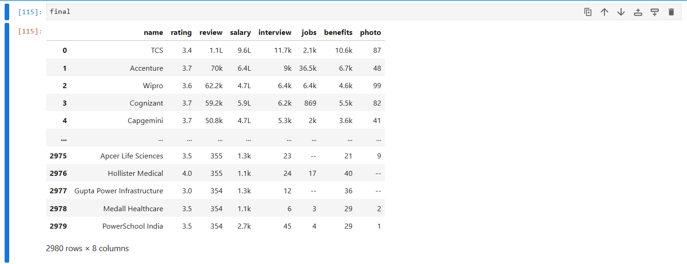

# web Screping

Web scraping is the process of extracting data from websites. It involves fetching the HTML content of a webpage and then parsing it to extract the desired information. This can be done using various programming languages and libraries.

## Libraries for Web Scraping

Some popular libraries for web scraping in Python include:
- **BeautifulSoup**: A library for parsing HTML and XML documents. It creates a parse tree for parsed pages that can be used to extract data from HTML.
- **Requests**: A simple HTTP library for making requests to web pages and handling responses.
- **Selenium**: A tool for automating web browsers. It can be used to
- interact with web pages that require JavaScript to load content.

## Example of Web Scraping with BeautifulSoup and Requests
```python
import pandas as pd
import requests
from bs4 import BeautifulSoup
headers = {
    "User-Agent": "Mozilla/5.0 (Windows NT 10.0; Win64; x64) AppleWebKit/537.36 (KHTML, like Gecko) Chrome/120.0.0.0 Safari/537.36",
    "Accept-Language": "en-US,en;q=0.9",
    "Accept": "text/html,application/xhtml+xml,application/xml;q=0.9,image/avif,image/webp,*/*;q=0.8",
    "Referer": "https://www.google.com/",
    "Connection": "keep-alive",
}


webpage=requests.get('https://www.ambitionbox.com/list-of-companies?campaign=desktop_nav&page=1',headers=headers).text
soup = BeautifulSoup(webpage, 'lxml')
# example len(soup.find_all('h2'))

main code
import requests
from bs4 import BeautifulSoup
import pandas as pd

final = pd.DataFrame()

for j in range(1, 150):   # <-- fixed colon
    
    headers = {
        "User-Agent": "Mozilla/5.0 (Windows NT 10.0; Win64; x64) AppleWebKit/537.36 (KHTML, like Gecko) Chrome/120.0.0.0 Safari/537.36",
        "Accept-Language": "en-US,en;q=0.9",
        "Referer": "https://www.google.com/",
    }

    url = f'https://www.ambitionbox.com/list-of-companies?campaign=desktop_nav&page={j}'
    webpage = requests.get(url, headers=headers).text
    soup = BeautifulSoup(webpage, 'lxml')

    comp = soup.find_all('div', class_='companyCardWrapper')   # <-- REQUIRED

    name=[]
    rating=[]
    review=[]
    salary=[]
    interview=[]
    jobs=[]
    benefits=[]
    photo=[]

    for i in comp:
        name.append(i.find('h2').text.strip())
        rating.append(i.find('div', class_='rating_text').text.strip())

        counts = i.find_all('span', class_='companyCardWrapper__ActionCount')

        review.append(counts[0].text.strip())
        salary.append(counts[1].text.strip())
        interview.append(counts[2].text.strip())
        jobs.append(counts[3].text.strip())
        benefits.append(counts[4].text.strip())
        photo.append(counts[5].text.strip())

    df = pd.DataFrame({
        'name': name,
        'rating': rating,
        'review': review,
        'salary': salary,
        'interview': interview,
        'jobs': jobs,
        'benefits': benefits,
        'photo': photo
    })

    final = pd.concat([final, df], ignore_index=True)


```

# result


## Ethical Considerations

When web scraping, it's important to consider the ethical implications:

